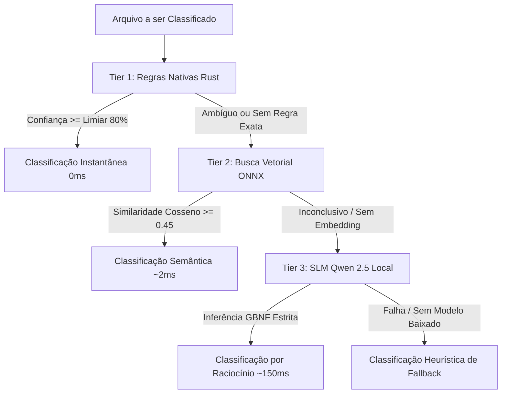
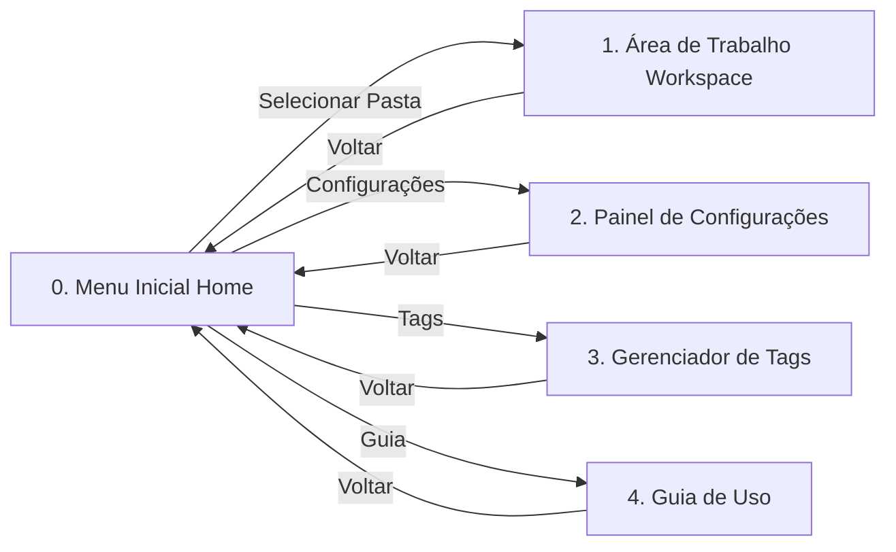
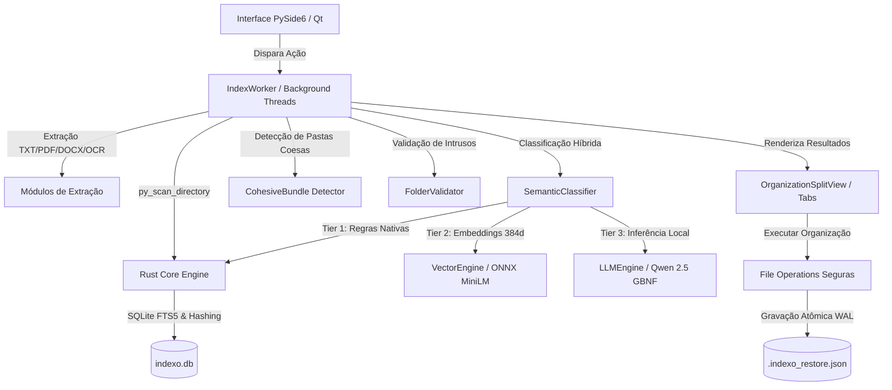

# Indexo-py — Sistema Inteligente de Organização Semântica de Arquivos

<p align="center">
  
</p>

<p align="center">
  <b>Organizador e indexador de arquivos semântico, inteligente e adaptativo para Windows.</b><br>
  Construído com arquitetura híbrida de alta performance: <b>Rust Core (via PyO3)</b>, interface desktop nativa em <b>Python (PySide6 / Qt)</b> e motor de <b>Inteligência Artificial Híbrida em Cascata (3 Tiers) 100% Local</b>.
</p>

<p align="center">
  
  
  
  
  
  
</p>

<p align="center">
  <b>Português</b> | <a href="README_EN.md">English</a>
</p>

> [!NOTE]
> **Repositório Indexo-py**: Este repositório preserva a versão completa construída em Python (PySide6 / Qt) e Rust Core (PyO3). A nova versão do Indexo desenvolvida em Rust (Tauri 2) e Svelte 5 reside no repositório principal [`Indexo`](https://github.com/pongitV/Indexo).

---

## Sumário

- [Sobre o Projeto](#sobre-o-projeto)
- [Principais Destaques](#principais-destaques)
- [Arquitetura de Inteligência Artificial Híbrida (3 Tiers)](#arquitetura-de-inteligência-artificial-híbrida-3-tiers)
- [Estrutura e Fluxo da Interface (UI/UX)](#estrutura-e-fluxo-da-interface-uiux)
- [Arquitetura do Sistema](#arquitetura-do-sistema)
- [Estrutura Completa do Repositório](#estrutura-completa-do-repositório)
- [Como Funciona o Aprendizado Adaptativo](#como-funciona-o-aprendizado-adaptativo)
- [Validação de Pastas e Detecção de Intrusos](#validação-de-pastas-e-detecção-de-intrusos)
- [Segurança, WAL e Desfazer em 1 Clique](#segurança-wal-e-desfazer-em-1-clique)
- [Como Executar e Desenvolver](#como-executar-e-desenvolver)
- [Verificação de Qualidade e Diagnósticos](#verificação-de-qualidade-e-diagnósticos)
- [Gerando o Executável Portátil Standalone](#gerando-o-executável-portátil-standalone)
- [Atalhos de Teclado](#atalhos-de-teclado)
- [Licença](#licença)

---

## Sobre o Projeto

O **Indexo-py** é um sistema completo de organização, classificação semântica e indexação rápida de arquivos para ambiente Windows. Ele resolve a desordem crônica de diretórios complexos (como *Downloads*, *Documentos* ou pastas de projetos desorganizados) através de uma abordagem híbrida inovadora:

1. **Rust Core (via PyO3)**: Responsável pela varredura ultrarrápida do sistema de arquivos, geração de hashes criptográficos e rápidos, indexação SQLite FTS5 em milissegundos, prevenção anti-traversal e resolução atômica de colisões de nomes.
2. **Interface Desktop Moderna (PySide6 / Qt)**: Uma experiência visual rica, fluida e personalizável, equipada com tema claro/escuro, redimensionamento dinâmico de fontes (acessibilidade), visualização prévia de documentos/mídia e navegação intuitiva em pilha de telas.
3. **Motor de IA Híbrida em Cascata (3 Tiers)**: Combina regras determinísticas em Rust (0ms), busca vetorial por embeddings semânticos ONNX (~2ms) e raciocínio profundo de modelos de linguagem locais (SLMs Qwen 2.5 via llama.cpp com gramática GBNF estrita), funcionando **100% offline**, sem telemetria e sem custos de nuvem.

---

## Principais Destaques

* **IA Híbrida em Cascata (3 Tiers)**: Triagem inteligente onde arquivos óbvios são classificados instantaneamente por regras em Rust (0ms), arquivos contextuais por busca vetorial semântica ONNX (~2ms) e arquivos ambíguos pelo modelo local Qwen 2.5 (~150ms no CPU).
* **Inteligência Adaptativa & Zero-Hardcode**: O Indexo não impõe categorias arbitrárias ou engessadas. Ele analisa o ambiente e aprende dinamicamente as **Categorias** e **Tags** com base nos padrões reais dos arquivos do usuário.
* **Preservação de Pacotes Coesos (`CohesiveBundle`)**: Detecta pastas com unidades funcionais fechadas (diretórios de jogos, código-fonte de projetos ou programas instalados) e move a **pasta-mãe inteira**, mantendo intacta toda a árvore de dependências internas.
* **Validação Semântica de Pastas e Detecção de Intrusos**: Identifica arquivos destoantes do propósito original de uma pasta (ex: um comprovante bancário ou instalador avulso perdido em uma pasta de código ou fotos).
* **Desfazer Completo em 1 Clique (WAL)**: Cada operação de movimentação é registrada de forma transacional no Write-Ahead Log (`.indexo_restore.json`), permitindo restaurar 100% dos arquivos aos seus locais de origem instantaneamente.
* **Busca Global Instantânea (`Ctrl+K`)**: Busca híbrida combinando texto exato indexado pelo SQLite FTS5 e similaridade vetorial semântica multilíngue.
* **Gerenciador Visual de Tags & Categorias (`Ctrl+M`)**: Crie, edite, pesquise e personalize regras, palavras-chave, expressões regulares, caminhos físicos e níveis de confiança base.
* **Guia Interativo de Conceitos Integrado (`F1`)**: Documentação interativa em 7 tópicos explicando a metodologia de organização, atalhos e mecanismos de segurança.
* **Customização de Renomeação Padronizada**: Padronização automática de nomes com datas normalizadas (`DD-MM-YYYY`, `YYYY-MM-DD`), entidade, separadores configuráveis e ajuste de caixa alta/baixa.
* **100% Portátil e Privado**: Funciona como executável autônomo, sem instaladores invasivos, sem gravação em registro e sem envio de dados para servidores externos.

---

## Arquitetura de Inteligência Artificial Híbrida (3 Tiers)

O Indexo adota um pipeline hierárquico em cascata para maximizar a precisão enquanto mantém a latência de processamento próxima a zero:



### Detalhamento dos Níveis (Tiers):

1. **Tier 1 — Regras Nativas e Heurísticas em Rust (`0ms`)**:
   - Executado diretamente pelo motor compiled nativo (`PyClassificationKernel`).
   - Casamento ultrarrápido de extensões, termos-chave normalizados e extração de entidades via expressões regulares pré-compiladas.
2. **Tier 2 — Busca Vetorial Semântica Multilíngue (`~2ms no CPU`)**:
   - Utiliza o modelo *Multilingual MiniLM* quantizado via **ONNX Runtime** para gerar vetores de 384 dimensões em ponto flutuante normalizados.
   - Realiza multiplicação matricial rápida de similaridade de cosseno contra os vetores pré-computados das categorias do sistema.
3. **Tier 3 — Raciocínio Profundo com SLMs Locais (`~150ms no CPU`)**:
   - Execução local do modelo **Qwen 2.5 Instruct** em formato quantizado GGUF via **llama.cpp**.
   - Gramática formal **GBNF (`INDEXO_JSON_GBNF`)** para forçar respostas estruturadas em JSON estrito sem alucinações de formato.
   - Analisa fragmentos extraídos de textos (PDFs, DOCX, TXT, OCR de imagens) e metadados.
   - **Gerenciamento Inteligente de RAM**: O modelo é mantido em memória apenas durante o uso e descarregado (`unload_model`) para devolver memória RAM ao Windows.

### Diagnóstico Automático de Hardware Win32 (`hardware_specs.py`)

No primeiro uso, o Indexo diagnostica os recursos físicos da máquina através da API Win32 e configura o perfil ideal:

| Perfil de Hardware | Critérios Detectados | Modelo Recomendado | Consumo de RAM |
| :--- | :--- | :--- | :--- |
| **Perfil Leve** | `< 6.0 GB RAM` ou `≤ 2 núcleos CPU` | **Qwen 2.5 0.5B Instruct** | ~650 MB |
| **Perfil Equilibrado** *(Recomendado)* | `6.0 GB a 14.0 GB RAM` | **Qwen 2.5 1.5B Instruct** | ~1.6 GB |
| **Perfil Alto Desempenho** | `≥ 14.0 GB RAM` (Core i7/i9/Ryzen 7+) | **Qwen 2.5 1.5B / 3B Instruct** | ~2.9 GB |

---

## Estrutura e Fluxo da Interface (UI/UX)

A interface do Indexo foi projetada em uma arquitetura de navegação limpa por pilha de telas (**Root Stack**) com transições suaves:



### 1. Tela Inicial (Menu Home)
Uma tela de apresentação limpa e acolhedora com logotipo de alta resolução, slogan e botão central destacado **Selecionar Pasta (Ctrl+O)**, além de atalhos rápidos no cabeçalho superior para Configurações, Tags e Guia.

### 2. Área de Trabalho (Workspace) com Seletor Unificado
Substitui abas congestionadas por um **Seletor Dropdown** elegante com 6 modos de visualização integrados e painel retrátil de pré-visualização à direita:
* **Organização (Antes x Depois)**: Visualização em árvore lado a lado com caminhos de origem e pastas sugeridas de destino, controle de permissão por pasta e caixas de ação para Pacotes Coesos.
* **Arquivos Pendentes**: Fila de arquivos com confiança abaixo do limiar, equipada com botão **Classificar com IA**, reclassificação manual e promoção de novas tags.
* **Arquivos Duplicados**: Identificação de arquivos duplicados por hash SHA-256 e tamanho exato, exibindo o espaço em disco que pode ser liberado.
* **Estatísticas & Métricas**: Painel gráfico visual com volumetria por categoria, distribuição percentual de arquivos e economia estimada de armazenamento.
* **Lixeira de Segurança**: Visualizador da lixeira interna da sessão, permitindo desmarcar exclusões acidentais antes de confirmar.
* **Inspecionar Raciocínio IA (`AILiveInspectorView`)**: Exibição em tempo real do fluxo analítico de decisão da IA (Metadados -> Extração de Texto -> Motor de Inferência -> Grau de Certeza -> Destino Proposto).

### 3. Painel Dedicado de Configurações (`SettingsView` / `Ctrl+,`)
* **Tema Visual**: Claro, Escuro e Automático (sincronizado com o sistema operacional).
* **Escala Universal de Fontes**: Ajuste acessível para 13px (Pequena), 15px (Normal), 17px (Grande) e 19px (Extra Grande).
* **Internacionalização**: Alternância dinâmica entre Português (ptBR) e English (enUS).
* **Limiar de Confiança**: Ajuste fino do nível mínimo de certeza (50% a 95%, padrão 80%).
* **Gerenciador de Modelos de IA**: Download e remoção com 1 clique de modelos GGUF e embeddings ONNX.
* **Playground de Teste da IA (`ai_tester.py`)**: Caixa interativa para testar qualquer nome de arquivo ou frase em tempo real, medindo a latência exata em milissegundos.
* **Customizador de Renomeação Padronizada**: Escolha de separadores, formato de data, posição de data e estilo de caixa com pré-visualização imediata.
* **Privacidade e Backup**: Limpeza de dados temporários e exportação/importação do arquivo de perfil `user_rules.json`.

### 4. Gerenciador de Tags & Categorias (`TagManagerView` / `Ctrl+M`)
Tabela interativa completa com busca em tempo real, suporte para criação de tags manuais, vinculação a categorias, definição de palavras-chave, regexes personalizadas, caminho físico no disco e nível de automação.

### 5. Guia Interativo de Uso (`GuideView` / `F1`)
Manual visual embutido cobrindo:
1. *Como o Indexo Organiza*
2. *Categorias e Tags Semânticas*
3. *Validação de Pastas e Intrusos*
4. *Pacotes Coesos (Jogos e Softwares)*
5. *Renomeação Padronizada*
6. *Segurança e Desfazer em 1 Clique (WAL)*
7. *Atalhos de Teclado e Navegação*

### 6. Assistente de Boas-Vindas (`OnboardingWizard`)
Diálogo em 2 etapas acionado na primeira execução com auto-diagnóstico do hardware, seleção de idioma do sistema e opção de **Configuração Automática em 1 Clique**.

---

## Arquitetura do Sistema



---

## Estrutura Completa do Repositório

```text
Indexo/
├── Cargo.lock                      # Trava de dependências do workspace Rust
├── Cargo.toml                      # Manifesto principal do workspace Rust
├── pyproject.toml                  # Configurações Python, Maturin, Pytest e Linters
├── rustfmt.toml                    # Diretrizes de formatação de código Rust
├── LICENSE                         # Licença GNU General Public License v3.0
├── README.md                       # Apresentação do projeto e guia do usuário (Português)
├── README_EN.md                    # Apresentação do projeto e guia do usuário (Inglês)
│
├── rust-core/                      # Motor nativo compilado em Rust (PyO3)
│   ├── Cargo.toml                  # Dependências Rust (pyo3, walkdir, rusqlite, sha2, rayon)
│   └── src/
│       ├── lib.rs                  # Exportação dos bindings nativos em Python
│       ├── indexing/               # Varredura multithreaded e banco de dados FTS5
│       │   ├── scanner.rs          # Leitura recursiva rápida de diretórios
│       │   ├── database.rs         # Operações SQLite FTS5 e persistência indexo.db
│       │   ├── hashing.rs          # Geração rápida de hashes SHA-256
│       │   ├── sanitize.rs         # Sanitização de caminhos e nomes no Windows
│       │   └── migrations.rs       # Versionamento do esquema do banco de dados
│       ├── classification/         # Kernel de regras determinísticas
│       │   ├── engine.rs           # Motor de classificação nativo
│       │   ├── matcher.rs          # Casador difuso e por expressões regulares
│       │   └── scoring.rs          # Cálculo e normalização de pontuação
│       ├── extraction/             # Extração rápida de metadados nativos
│       │   ├── text.rs             # Processamento inicial de arquivos textuais
│       │   ├── image.rs            # Extração de dimensões e metadados EXIF
│       │   └── audio.rs            # Metadados de arquivos de áudio
│       └── utils/                  # Utilitários de segurança de baixo nível
│           ├── path_resolver.rs    # Prevenção rigorosa de Directory Traversal
│           └── error_handler.rs    # Tratamento estruturado de erros FFI
│
├── python-app/                     # Aplicação Desktop PySide6
│   ├── requirements.txt            # Dependências Python (PySide6, onnxruntime, llama-cpp, etc.)
│   ├── main.py                     # Ponto de entrada, Single-Instance Lock e Onboarding
│   └── app/
│       ├── main_window.py          # Janela principal e orquestração de telas (Root Stack)
│       ├── ai/                     # Motor de Inteligência Artificial Híbrida
│       │   ├── hardware_specs.py   # Diagnóstico Win32 de CPU/RAM e recomendação de perfil
│       │   ├── model_manager.py    # Gerenciador de downloads do Hugging Face e cache
│       │   ├── vector_engine.py    # Motor ONNX Runtime para busca vetorial de 384 dimensões
│       │   ├── llm_engine.py       # Raciocínio local com Qwen 2.5 via llama.cpp e GBNF
│       │   ├── semantic_classifier.py # Pipeline cascateado de classificação em 3 Tiers
│       │   └── ai_tester.py        # Diagnóstico e teste de IA em tempo real com latência
│       ├── classification/         # Descoberta adaptativa de regras e validação
│       │   ├── similarity_engine.py # Hierarquia Nome -> Conteúdo -> Formato
│       │   ├── tag_discovery.py    # Aprendizado dinâmico de categorias e tags
│       │   ├── folder_validator.py # Detecção de intrusos e validação de pastas
│       │   ├── rule_loader.py      # Carregamento e mesclagem de regras (sistema + usuário)
│       │   ├── regex_rules.py      # Regras dinâmicas baseadas em expressões regulares
│       │   ├── entity_regex.py     # Reconhecimento de entidades e padronização de nomes
│       │   └── confidence.py       # Algoritmos de ponderação de confiança
│       ├── extraction/             # Módulos de extração de conteúdo
│       │   ├── pdf_extractor.py    # Extração de texto de documentos PDF
│       │   ├── doc_extractor.py    # Extração de texto de arquivos DOCX/Office
│       │   └── ocr_engine.py       # Extração OCR local para imagens digitalizadas
│       ├── onboarding/             # Assistente de primeira inicialização
│       │   └── onboarding_wizard.py# Wizard de 2 etapas com auto-detecção de hardware
│       ├── config/                 # Gerenciamento de configurações e constantes
│       │   ├── settings_manager.py # Leitura e persistência de preferências do usuário
│       │   └── constants.py        # Definições de constantes e extensões suportadas
│       ├── i18n/                   # Sistema dinâmico de internacionalização
│       │   └── language_manager.py # Gerenciador singleton de traduções em runtime
│       ├── models/                 # Modelos de dados e representações de arquivos
│       │   ├── file_item.py        # Dataclass do arquivo analisado
│       │   └── rules.py            # Estrutura formal das regras semânticas
│       ├── utils/                  # Utilitários de sistema de arquivos e interface
│       │   ├── file_ops.py         # Movimentação atômica, resolução de colisão e WAL
│       │   ├── theme_manager.py    # Gestão de temas (Claro/Escuro/Sistema) e QSS
│       │   ├── formatters.py       # Formatação de bytes, datas e durações
│       │   └── logger_setup.py     # Configuração de rotação de logs com loguru
│       ├── widgets/                # Componentes e telas da interface gráfica
│       │   ├── organization_view.py# Árvore Antes x Depois e painel de pacotes coesos
│       │   ├── pending_list.py     # Fila de revisão de arquivos pendentes
│       │   ├── duplicate_view.py   # Visualizador de duplicatas por SHA-256
│       │   ├── stats_view.py       # Painel gráfico visual de volumetria e métricas
│       │   ├── trash_view.py       # Lixeira de segurança interna da sessão
│       │   ├── ai_live_inspector_view.py # Stream de raciocínio da IA em tempo real
│       │   ├── settings_view.py    # Painel completo de configurações e IA Playground
│       │   ├── tag_manager_view.py # Gerenciador avançado de tags e categorias
│       │   ├── guide_view.py       # Guia interativo em 7 tópicos com atalhos
│       │   ├── preview_panel.py    # Painel lateral retrátil de visualização rápida
│       │   ├── palette.py          # Paleta de busca rápida global Ctrl+K
│       │   ├── shortcuts_dialog.py # Diálogo modal de atalhos de teclado
│       │   ├── folder_review.py    # Revisão de coerência de pastas
│       │   ├── dry_run_tree.py     # Árvore de simulação pré-execução
│       │   ├── file_context_menu.py# Menu de contexto do botão direito
│       │   ├── lite_mode.py        # Modo visual compacto
│       │   ├── tree_view.py        # Visualizador virtual em árvore
│       │   └── smooth_scroll.py    # Suavização cinemática de rolagem
│       └── workers/                # Threads assíncronas em segundo plano
│           ├── index_worker.py     # Thread mestre de indexação e classificação
│           └── ai_worker.py        # Thread assíncrona de download e inferência de IA
│
├── resources/                      # Recursos estáticos e modelos base
│   ├── icon.ico / icon.png         # Ícones em alta resolução da aplicação
│   ├── system_rules.json           # Regras semânticas base de fábrica
│   ├── RECURSOS.md                 # Documentação descritiva dos ativos estáticos
│   ├── models/                     # Diretório de modelos pré-instalados/sincronizados
│   └── i18n/                       # Dicionários de tradução
│       ├── ptBR.json               # Dicionário completo em Português do Brasil
│       └── enUS.json               # Dicionário completo em Inglês
│
├── configs/                        # Configurações de usuário locais (Portáteis)
│   ├── user_rules.json             # Regras e tags personalizadas aprendidas
│   └── user_rules.bak.json         # Backup automático do perfil
│
├── scripts/                        # Scripts de automação, diagnóstico e empacotamento
│   ├── dev_run.py                  # Inicialização rápida no ambiente de desenvolvimento
│   ├── check.py                    # Diagnóstico unificado de integridade e regras
│   ├── build.py                    # Pipeline de compilação PyInstaller portátil
│   ├── clean.py                    # Limpeza de caches e bancos de teste
│   ├── generate_test_dataset.py    # Gerador sintético de arquivos para testes de estresse
│   └── GUIA_SCRIPTS.md             # Guia de uso dos utilitários de desenvolvimento
│
├── tests/                          # Suite completa de testes automatizados (pytest)
│   ├── test_all_app_configurations.py           # Testes de configurações e preferências
│   ├── test_ai_modules.py                       # Testes unitários dos motores de IA
│   ├── test_ai_benchmark_and_capabilities.py    # Benchmark de latência e acurácia da IA
│   ├── test_folder_hypothesis_and_semantic_cleaning.py # Validação de pastas e intrusos
│   ├── test_end_to_end_organization.py          # Teste end-to-end de movimentação e WAL
│   └── test_ui_flow.py                          # Testes de fluxo e componentes de interface
│
└── Portable-EXE/                   # Distribuição portátil autônoma consolidada
    ├── Indexo.exe                  # Executável portátil 100% autônomo para Windows (PyInstaller --onefile)
    └── README.md                   # Guia de uso da versão portátil
```

---

## Como Funciona o Aprendizado Adaptativo

O Indexo opera sob o conceito de **inteligência viva e mínima dependência de hardcode**:

1. **Topologia e Hierarquia Real de Diretórios**:
   - Estruturas como `Viagens/Praia_2024/foto.jpg` ensinam `Viagens` como a **Categoria** e `Praia 2024` como a **Tag**.
   - Diretórios como `Projetos/MeuSoftware/main.py` criam a Categoria `Projetos` e a Tag `MeuSoftware`.
2. **Clusterização por Macro-Radicais de Nomes**:
   - Arquivos compartilhando prefixos semânticos (ex: `Fatura_FornecedorA.pdf`, `Fatura_FornecedorB.pdf`) geram a Categoria `Faturas` e as Tags individuais de cada fornecedor.
3. **Preservação de Pacotes Coesos (`CohesiveBundle`)**:
   - Se uma pasta contém binários principais (`.exe`, `.dll`), arquivos de assets de jogos (`.pak`, `.wad`, `.unity3d`, `.assets`) ou arquivos de manifesto de software (`package.json`, `Cargo.toml`, `requirements.txt`), ela é tratada como um bloco único.
   - O Indexo propõe mover a **pasta completa** para `Indexo_Files/Jogos/<NomeDoJogo>/` ou `Indexo_Files/Projetos/<NomeDoProjeto>/`, evitando a quebra de dependências.
4. **Persistência Incremental**:
   - Todas as categorias e tags aprendidas são salvas no perfil `user_rules.json` e reaproveitadas automaticamente nas próximas sessões.

---

## Validação de Pastas e Detecção de Intrusos

O módulo `folder_validator.py` analisa a coerência interna de cada subpasta:
* **Detecção de Intrusos**: Se uma pasta de fotos contiver um arquivo `.pdf` avulso de boleto, o validador sinaliza o arquivo como intruso e oferece a oportunidade de enviá-lo para a Categoria de Finanças correta.
* **Preservação de Álbuns e Coleções**: Se uma pasta contiver arquivos homogêneos (ex: 15 faixas `.mp3` de um mesmo álbum musical), a pasta é preservada em sua estrutura original.

---

## Segurança, WAL e Desfazer em 1 Clique

O Indexo foi projetado para garantir risco zero de perda de dados:

* **Write-Ahead Log (WAL) Transacional**: Toda movimentação física no disco é gravada atomicamente no arquivo `.indexo_restore.json` antes e depois da execução.
* **Desfazer Completo em 1 Clique**: Caso o usuário deseje reverter a organização, basta pressionar **Ctrl+Z** ou clicar em **Desfazer Última Organização** para que 100% dos arquivos retornem exatamente aos seus locais de origem.
* **Resolução Inteligente de Colisões**: Se já existir um arquivo de mesmo nome no destino, o motor nativo em Rust adiciona automaticamente um sufixo numérico (ex: `Relatorio (1).pdf`), impedindo qualquer sobrescrita acidental.
* **Proteção contra Directory Traversal**: Todos os caminhos de destino são rigorosamente validados para impedir que arquivos sejam gravados fora do escopo selecionado pelo usuário.

---

## Como Executar e Desenvolver

### Pré-requisitos

* **Windows 10 ou 11 (64-bit)**
* **Python 3.10+**
* **Rust Toolchain (Cargo 1.75+)**

### 1. Clonar o Repositório

```powershell
git clone https://github.com/pongitV/Indexo-py.git
cd Indexo-py
```

### 2. Instalar Dependências e Compilar o Rust Core

```powershell
python -m pip install -r python-app/requirements.txt
python -m pip install maturin
maturin develop --manifest-path rust-core/Cargo.toml
```

### 3. Iniciar em Modo de Desenvolvimento

```powershell
python scripts/dev_run.py
```

---

## Verificação de Qualidade e Diagnósticos

Para executar a validação unificada de integridade de regras semânticas, paridade de internacionalização (i18n), testes unitários em Rust e suite completa em Python:

```powershell
python scripts/check.py
```

Para rodar a suite de testes automatizados diretamente via `pytest`:

```powershell
python -m pytest tests/ -v
```

---

## Gerando o Executável Portátil Standalone

Para compilar os módulos nativos em modo release e empacotar a aplicação em um único executável portátil autônomo:

```powershell
python scripts/build.py
```

O executável final será gerado em:
`Portable-EXE/Indexo.exe`

---

## Atalhos de Teclado

| Atalho | Ação Principal |
| :--- | :--- |
| <kbd>Ctrl</kbd> + <kbd>O</kbd> | Selecionar pasta para varredura e organização |
| <kbd>Ctrl</kbd> + <kbd>K</kbd> | Abertura rápida da Busca Global Semântica |
| <kbd>Ctrl</kbd> + <kbd>M</kbd> | Abrir o Gerenciador de Tags & Categorias |
| <kbd>Ctrl</kbd> + <kbd>,</kbd> | Abrir o painel de Configurações |
| <kbd>F1</kbd> | Abrir o Guia Interativo de Uso e Conceitos |
| <kbd>Ctrl</kbd> + <kbd>Enter</kbd> | Executar organização física no disco |
| <kbd>Ctrl</kbd> + <kbd>Z</kbd> | Desfazer última sessão de organização (Restaurar WAL) |
| <kbd>F5</kbd> | Atualizar visualização e reavaliar diretório atual |
| <kbd>Esc</kbd> | Voltar para a tela anterior / Fechar painel de pré-visualização |

---

## Licença

Este projeto é software livre e de código aberto, distribuído sob a licença **GNU General Public License v3.0 (GPLv3)**. Consulte o arquivo [LICENSE](LICENSE) para mais detalhes.
