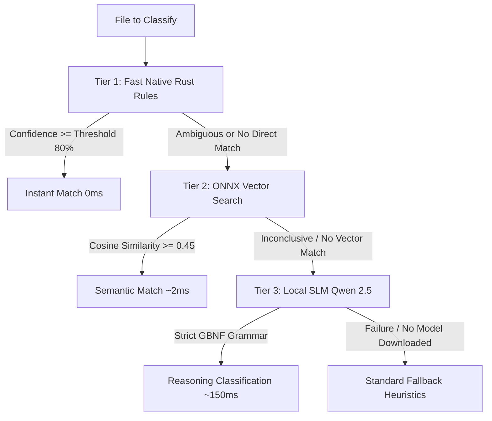
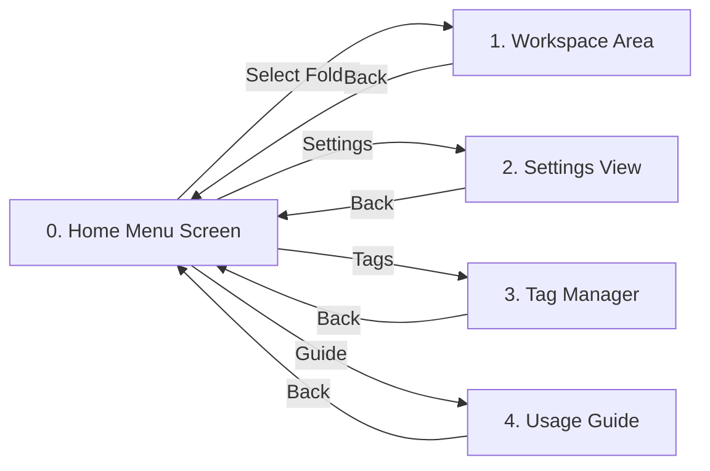
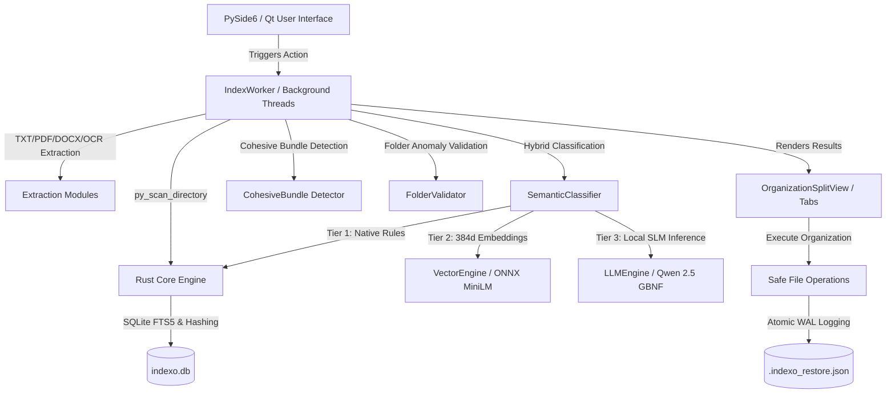

# Indexo-py — Intelligent Semantic File Organization System

<p align="center">
  
</p>

<p align="center">
  <b>Semantic, intelligent, and adaptive file organizer and indexer for Windows.</b><br>
  Built with a high-performance hybrid architecture: <b>Rust Core (via PyO3)</b>, native desktop UI in <b>Python (PySide6 / Qt)</b>, and a <b>100% Local 3-Tier Cascaded Artificial Intelligence Engine</b>.
</p>

<p align="center">
  
  
  
  
  
  
</p>

<p align="center">
  <a href="README.md">Português</a> | <b>English</b>
</p>

> [!NOTE]
> **Indexo-py Repository**: This repository preserves the complete implementation built in Python (PySide6 / Qt) and Rust Core (PyO3). The new version of Indexo built with Rust (Tauri 2) and Svelte 5 is available in the main [`Indexo`](https://github.com/pongitV/Indexo) repository.

---

## Table of Contents

- [About the Project](#about-the-project)
- [Key Highlights](#key-highlights)
- [Hybrid 3-Tier Cascaded AI Architecture](#hybrid-3-tier-cascaded-ai-architecture)
- [UI/UX Structure and Navigation Flow](#uiux-structure-and-navigation-flow)
- [System Architecture](#system-architecture)
- [Complete Repository Structure](#complete-repository-structure)
- [How Adaptive Learning Works](#how-adaptive-learning-works)
- [Folder Validation & Anomaly Detection](#folder-validation--anomaly-detection)
- [Safety, Write-Ahead Log (WAL), and 1-Click Undo](#safety-write-ahead-log-wal-and-1-click-undo)
- [Getting Started & Development](#getting-started--development)
- [Quality Assurance & Diagnostics](#quality-assurance--diagnostics)
- [Building the Standalone Portable Executable](#building-the-standalone-portable-executable)
- [Keyboard Shortcuts](#keyboard-shortcuts)
- [License](#license)

---

## About the Project

**Indexo-py** is a comprehensive file organization, semantic classification, and rapid indexing desktop application for Windows. It solves chronic folder clutter (such as messy *Downloads*, *Documents*, or disarranged project directories) through an innovative hybrid architecture:

1. **Rust Core (via PyO3)**: High-speed multithreaded directory traversal, fast and cryptographic hashing, millisecond SQLite FTS5 full-text indexing, strict anti-traversal protection, and atomic name collision resolution.
2. **Modern Desktop UI (PySide6 / Qt)**: A fluid, customizable, and responsive user experience featuring dark/light/system themes, universal font size scaling (accessibility), instant document/media previews, and a clean Root Stack screen architecture.
3. **Hybrid 3-Tier Cascaded AI Engine**: Combines native deterministic rules in Rust (0ms), multilingual vector semantic search powered by ONNX Runtime (~2ms), and deep contextual reasoning via local Small Language Models (Qwen 2.5 GGUF via llama.cpp with strict GBNF grammar). Operates **100% offline**, ensuring total privacy with zero cloud costs or telemetry.

---

## Key Highlights

* **Cascaded 3-Tier AI**: Intelligent triage pipeline where straightforward files are classified instantly by native Rust rules (0ms), contextual files by ONNX vector search (~2ms), and ambiguous/pending files by local SLM Qwen 2.5 (~150ms on CPU).
* **Adaptive Intelligence & Zero-Hardcode**: Never enforces rigid pre-baked categories. Analyzes directory topologies to learn **Categories** and **Tags** dynamically from real user file patterns.
* **Preservation of Cohesive Bundles (`CohesiveBundle`)**: Detects closed functional units (game directories, project source trees, or installed programs) and moves the **entire parent folder**, preserving all internal dependency trees.
* **Folder Validation & Anomaly Cleaning**: Detects intruder files out of context (e.g., a bank receipt or installer stranded inside a photo album or source code directory).
* **Full 1-Click Undo (WAL)**: Every physical file operation is atomically recorded in a Write-Ahead Log (`.indexo_restore.json`), allowing users to revert 100% of the session instantaneously.
* **Instant Global Search (`Ctrl+K`)**: Unified search combining SQLite FTS5 exact indexing and multilingual vector semantic similarity.
* **Visual Tag & Category Manager (`Ctrl+M`)**: Create, edit, search, and manage rules, keywords, regex patterns, physical destination paths, and baseline confidence thresholds.
* **Integrated Interactive Concept Guide (`F1`)**: Built-in 7-topic interactive documentation explaining organization methodologies, shortcuts, and safety protocols.
* **Standardized Renaming Customizer**: Automated filename standardization with normalized date formats (`DD-MM-YYYY`, `YYYY-MM-DD`), entity extraction, configurable separators, and casing rules.
* **100% Portable & Private**: Ships as a single standalone executable without installers, registry writes, or external network requests.

---

## Hybrid 3-Tier Cascaded AI Architecture

Indexo-py uses a hierarchical pipeline to maximize classification accuracy while keeping latency close to zero:



### Breakdown of the 3 Tiers:

1. **Tier 1 — Fast Native Rust Rules & Heuristics (`0ms`)**:
   - Executed directly by the compiled native kernel (`PyClassificationKernel`).
   - Ultra-fast matching of extensions, normalized keyword stems, and pre-compiled regex entity extraction.
2. **Tier 2 — Multilingual Semantic Vector Search (`~2ms on CPU`)**:
   - Powered by quantized *Multilingual MiniLM* using **ONNX Runtime** to generate 384-dimensional normalized float32 vectors.
   - Computes vectorized matrix dot-product cosine similarity against pre-computed category embeddings.
3. **Tier 3 — Deep Reasoning with Local SLMs (`~150ms on CPU`)**:
   - Executes quantized **Qwen 2.5 Instruct** GGUF models locally via **llama.cpp**.
   - Formal **GBNF grammar (`INDEXO_JSON_GBNF`)** guarantees structured JSON responses with zero format hallucinations.
   - Evaluates extracted snippets from text files (PDFs, DOCX, TXT, OCR) and metadata.
   - **Smart RAM Management**: The model is loaded on-demand and promptly unloaded (`unload_model`) to return RAM back to Windows.

### Automatic Win32 Hardware Diagnostics (`hardware_specs.py`)

Upon initial launch, Indexo-py profiles system hardware using native Win32 APIs and selects the optimal AI profile:

| Hardware Profile | Detected Criteria | Recommended Model | RAM Usage |
| :--- | :--- | :--- | :--- |
| **Lightweight Profile** | `< 6.0 GB RAM` or `≤ 2 CPU Cores` | **Qwen 2.5 0.5B Instruct** | ~650 MB |
| **Balanced Profile** *(Recommended)* | `6.0 GB to 14.0 GB RAM` | **Qwen 2.5 1.5B Instruct** | ~1.6 GB |
| **High Performance Profile** | `≥ 14.0 GB RAM` (Core i7/i9/Ryzen 7+) | **Qwen 2.5 1.5B / 3B Instruct** | ~2.9 GB |

---

## UI/UX Structure and Navigation Flow

Indexo-py is designed around a clean, modern **Root Stack** screen flow:



### 1. Home Menu Screen
A welcoming and minimalist landing view featuring high-resolution branding, slogan, and a prominent **Select Folder (Ctrl+O)** action button, alongside top-right shortcuts to Settings, Tags, and the Guide.

### 2. Workspace with Unified Dropdown Switcher
Replaces cluttered tabs with a streamlined **Dropdown View Switcher** featuring 6 specialized view modes and a collapsible preview panel on the right:
* **Organization (Before vs. After)**: Side-by-side tree comparison showing original paths and proposed target directories, per-folder permission toggles, and Cohesive Bundle action controls.
* **Pending Files Queue**: Review queue for low-confidence files, equipped with **Classify with AI**, manual reclassification, and tag promotion.
* **Duplicate Files Finder**: Groups exact duplicate files by SHA-256 hash and size, calculating reclaimable disk space.
* **Statistics & Metrics Dashboard**: Visual graphs and volumetric metrics detailing category distribution and storage savings.
* **Safety Recycle Bin**: In-session safety bin allowing users to verify or undo marked file deletions.
* **AI Live Reasoning Inspector (`AILiveInspectorView`)**: Real-time analytical thought stream displaying the AI decision process for each file (Metadata -> Text Extraction -> Inference Engine -> Confidence Score -> Target Path).

### 3. Dedicated Settings Panel (`SettingsView` / `Ctrl+,`)
* **Visual Theme**: Light, Dark, or System Sync.
* **Universal Font Size**: Scalable interface typography for 13px (Small), 15px (Normal), 17px (Large), and 19px (Extra Large).
* **Language**: Instant runtime switching between English (enUS) and Portuguese (ptBR).
* **Confidence Threshold**: Fine-tune minimum classification threshold (50% to 95%, default 80%).
* **AI Model Manager**: 1-click download, status check, and deletion of GGUF and ONNX models.
* **Interactive AI Playground (`ai_tester.py`)**: Real-time classification tester for any query string with millisecond latency measurement.
* **Standardized Renaming Customizer**: Configure delimiters, date formats, date positions, and letter casing with live preview.
* **Privacy & Profile Backup**: Data clearing and `user_rules.json` profile export/import.

### 4. Tag & Category Manager (`TagManagerView` / `Ctrl+M`)
Full-featured interactive table with instant filtering, manual tag creation, category linking, keywords, custom regexes, destination paths, and automation toggles.

### 5. Interactive Concept Guide (`GuideView` / `F1`)
Integrated visual manual covering:
1. *How Indexo Organizes*
2. *Categories and Semantic Tags*
3. *Folder Validation and Intruders*
4. *Cohesive Bundles (Games & Projects)*
5. *Standardized Renaming*
6. *Safety & 1-Click Undo (WAL)*
7. *Keyboard Shortcuts and Navigation*

### 6. First-Launch Onboarding Wizard (`OnboardingWizard`)
A 2-step setup dialog triggered on the first run, providing automatic hardware detection, system language discovery, and **1-Click Auto Setup**.

---

## System Architecture



---

## Complete Repository Structure

```text
Indexo/
├── Cargo.lock                      # Rust workspace dependency lockfile
├── Cargo.toml                      # Master Rust workspace manifest
├── pyproject.toml                  # Python, Maturin, Pytest, and Linter configuration
├── rustfmt.toml                    # Standard Rust code formatting rules
├── LICENSE                         # GNU General Public License v3.0
├── README.md                       # Project overview and user guide (Portuguese)
├── README_EN.md                    # Project overview and user guide (English)
│
├── rust-core/                      # Native Rust engine (PyO3)
│   ├── Cargo.toml                  # Rust dependencies (pyo3, walkdir, rusqlite, sha2, rayon)
│   └── src/
│       ├── lib.rs                  # Python FFI bindings via PyO3
│       ├── indexing/               # Multithreaded scanning and FTS5 database
│       │   ├── scanner.rs          # High-speed recursive directory scanner
│       │   ├── database.rs         # SQLite FTS5 operations and indexo.db persistence
│       │   ├── hashing.rs          # Fast SHA-256 hash generation
│       │   ├── sanitize.rs         # Windows path and filename sanitization
│       │   └── migrations.rs       # Database schema versioning
│       ├── classification/         # Deterministic rules kernel
│       │   ├── engine.rs           # Native classification engine
│       │   ├── matcher.rs          # Fuzzy and regex matchers
│       │   └── scoring.rs          # Score calculation and normalization
│       ├── extraction/             # Fast native metadata extraction
│       │   ├── text.rs             # Initial textual file processing
│       │   ├── image.rs            # Dimensions and EXIF metadata extraction
│       │   └── audio.rs            # Audio file metadata
│       └── utils/                  # Low-level security utilities
│           ├── path_resolver.rs    # Anti-traversal path validation
│           └── error_handler.rs    # Structured FFI error handling
│
├── python-app/                     # PySide6 Desktop Application
│   ├── requirements.txt            # Python dependencies (PySide6, onnxruntime, llama-cpp, etc.)
│   ├── main.py                     # Entry point, Single-Instance Lock, and Onboarding
│   └── app/
│       ├── main_window.py          # Main window and screen orchestration (Root Stack)
│       ├── ai/                     # Hybrid Artificial Intelligence Engine
│       │   ├── hardware_specs.py   # Win32 CPU/RAM diagnostics and profile recommendation
│       │   ├── model_manager.py    # Hugging Face download manager and local cache
│       │   ├── vector_engine.py    # ONNX Runtime 384-dim semantic embedding engine
│       │   ├── llm_engine.py       # Local reasoning with Qwen 2.5 via llama.cpp and GBNF
│       │   ├── semantic_classifier.py # Cascaded 3-tier hybrid classification pipeline
│       │   └── ai_tester.py        # Real-time AI diagnostic tester with latency stats
│       ├── classification/         # Adaptive rule discovery and validation
│       │   ├── similarity_engine.py # Hierarchy: Name -> Content -> Format
│       │   ├── tag_discovery.py    # Dynamic category and tag learning
│       │   ├── folder_validator.py # Intruder detection and folder coherence validation
│       │   ├── rule_loader.py      # Rule loading and merging (system + user rules)
│       │   ├── entity_regex.py     # Entity extraction and filename standardization
│       │   └── confidence.py       # Confidence weighting algorithms
│       ├── extraction/             # Content extraction modules
│       │   ├── pdf_extractor.py    # PDF document text extractor
│       │   ├── doc_extractor.py    # DOCX and Office document text extractor
│       │   └── ocr_engine.py       # Local OCR engine for scanned images
│       ├── onboarding/             # First-launch onboarding wizard
│       │   └── onboarding_wizard.py# 2-step wizard with automatic hardware profiling
│       ├── config/                 # Configuration and constants management
│       │   ├── settings_manager.py # User preference persistence and retrieval
│       │   └── constants.py        # Constants and supported file extensions
│       ├── i18n/                   # Dynamic internationalization system
│       │   └── language_manager.py # Runtime translation singleton manager
│       ├── models/                 # Data models and file item representations
│       │   ├── file_item.py        # File item dataclass
│       │   └── rules.py            # Semantic rule formal schemas
│       ├── utils/                  # Filesystem and UI utilities
│       │   ├── file_ops.py         # Atomic move operations, collision resolution, and WAL
│       │   ├── theme_manager.py    # Theme management (Light/Dark/System) and QSS styles
│       │   ├── formatters.py       # Byte, date, and time duration formatting
│       │   └── logger_setup.py     # Loguru logging setup and log rotation
│       ├── widgets/                # UI components and view panels
│       │   ├── organization_view.py# Before vs. After split tree and bundle panel
│       │   ├── pending_list.py     # Pending files review queue
│       │   ├── duplicate_view.py   # SHA-256 duplicate file browser
│       │   ├── stats_view.py       # Visual charts and storage volumetric metrics
│       │   ├── trash_view.py       # In-session safety recycle bin
│       │   ├── ai_live_inspector_view.py # Real-time AI thought stream inspector
│       │   ├── settings_view.py    # General settings panel and AI Playground
│       │   ├── tag_manager_view.py # Advanced tag and category management view
│       │   ├── guide_view.py       # Interactive 7-topic documentation guide
│       │   ├── preview_panel.py    # Collapsible sidebar preview panel
│       │   ├── palette.py          # Quick Ctrl+K search palette
│       │   ├── shortcuts_dialog.py # Keyboard shortcuts guide dialog
│       │   ├── folder_review.py    # Folder review and coherence checker
│       │   ├── dry_run_tree.py     # Pre-execution simulation tree
│       │   ├── file_context_menu.py# Right-click context menu
│       │   ├── lite_mode.py        # Compact UI view mode
│       │   ├── tree_view.py        # Virtual tree viewer
│       │   └── smooth_scroll.py    # Smooth scroll area widget
│       └── workers/                # Background worker threads
│           ├── index_worker.py     # Master indexing and classification worker thread
│           └── ai_worker.py        # Asynchronous AI download and inference worker
│
├── resources/                      # Static visual assets and rule schemas
│   ├── icon.ico / icon.png         # High-resolution application icons
│   ├── system_rules.json           # Default factory semantic rule schemas
│   ├── RECURSOS.md                 # Static assets descriptive documentation
│   ├── models/                     # Pre-installed / synchronized models folder
│   └── i18n/                       # Translation dictionaries
│       ├── ptBR.json               # Brazilian Portuguese translation dictionary
│       └── enUS.json               # English translation dictionary
│
├── configs/                        # Local portable user configurations
│   ├── user_rules.json             # Dynamically learned user rules and tags
│   └── user_rules.bak.json         # Automated profile backup
│
├── scripts/                        # Automation, diagnostic, and packaging scripts
│   ├── dev_run.py                  # Quick development launch script
│   ├── check.py                    # Unified integrity and rule diagnostic
│   ├── build.py                    # Portable PyInstaller build pipeline
│   ├── clean.py                    # Cache, temp database, and artifact cleaner
│   ├── generate_test_dataset.py    # Synthetic stress-test dataset generator
│   └── GUIA_SCRIPTS.md             # Developer script usage guide
│
├── tests/                          # Automated pytest test suite
│   ├── test_all_app_configurations.py           # Configuration and settings tests
│   ├── test_ai_modules.py                       # AI engine unit tests
│   ├── test_ai_benchmark_and_capabilities.py    # AI accuracy and latency benchmarks
│   ├── test_folder_hypothesis_and_semantic_cleaning.py # Folder validation tests
│   ├── test_end_to_end_organization.py          # End-to-end organization and WAL tests
│   └── test_ui_flow.py                          # UI flow and component tests
│
└── Portable-EXE/                   # Consolidated portable standalone distribution
    ├── Indexo-Portable/            # Final standalone distribution directory
    │   ├── Indexo.exe              # 100% Standalone Windows Portable Executable
    │   └── ...                     # Packaged dependencies
    └── README.md                   # Portable usage guide and persistence notes
```

---

## How Adaptive Learning Works

Indexo-py is guided by the philosophy of **dynamic intelligence and zero hardcoded rigidity**:

1. **Directory Topology & Real-World Hierarchy**:
   - Structures like `Vacations/Hawaii_2024/photo.jpg` establish `Vacations` as the **Category** and `Hawaii 2024` as the **Tag**.
   - Directories like `Projects/MyApp/main.py` yield the Category `Projects` and the Tag `MyApp`.
2. **Clustering by Common Name Stems**:
   - Files sharing common semantic prefixes (e.g., `Invoice_VendorA.pdf`, `Invoice_VendorB.pdf`) generate the Category `Invoices` and corresponding vendor Tags.
3. **Preservation of Cohesive Bundles (`CohesiveBundle`)**:
   - If a folder contains primary executables (`.exe`, `.dll`), game package assets (`.pak`, `.wad`, `.unity3d`, `.assets`), or project manifest files (`package.json`, `Cargo.toml`, `requirements.txt`), it is treated as a unified package.
   - Indexo-py proposes moving the **entire folder** to `Indexo_Files/Games/<GameName>/` or `Indexo_Files/Projects/<ProjectName>/`, preventing broken dependencies.
4. **Incremental Persistence**:
   - All newly learned categories and tags are saved into `user_rules.json` and automatically reused in future sessions.

---

## Folder Validation & Anomaly Detection

The `folder_validator.py` module evaluates internal subfolder coherence:
* **Intruder Detection**: If a photo album contains an isolated financial `.pdf` receipt, the validator flags the intruder file and suggests moving it to the appropriate Finance category.
* **Album & Collection Preservation**: Homogeneous folders (such as 15 `.mp3` tracks belonging to the same music album) are preserved intact.

---

## Safety, Write-Ahead Log (WAL), and 1-Click Undo

Indexo-py is built with zero tolerance for accidental data loss:

* **Transactional Write-Ahead Log (WAL)**: Every physical file movement is logged atomically in `.indexo_restore.json` before and after execution.
* **Full 1-Click Undo**: Users can press **Ctrl+Z** or click **Undo Last Organization** to restore 100% of files back to their exact original locations.
* **Smart Collision Resolution**: If a file with an identical name already exists at the destination, the native Rust core appends an incremental numeric suffix (e.g., `Report (1).pdf`), preventing accidental overwrites.
* **Anti-Directory Traversal Protection**: Target destination paths are rigorously sanitized and validated to prevent files from escaping the user's intended target root.

---

## Getting Started & Development

### Prerequisites

* **Windows 10 or 11 (64-bit)**
* **Python 3.10+**
* **Rust Toolchain (Cargo 1.75+)**

### 1. Clone the Repository

```powershell
git clone https://github.com/pongitV/Indexo-py.git
cd Indexo-py
```

### 2. Install Dependencies and Build the Rust Core

```powershell
python -m pip install -r python-app/requirements.txt
python -m pip install maturin
maturin develop --manifest-path rust-core/Cargo.toml
```

### 3. Start in Development Mode

```powershell
python scripts/dev_run.py
```

---

## Quality Assurance & Diagnostics

To run the unified diagnostic covering semantic rule integrity, internationalization (i18n) parity, native Rust unit tests, and Python test suites:

```powershell
python scripts/check.py
```

To run the automated test suite directly with `pytest`:

```powershell
python -m pytest tests/ -v
```

---

## Building the Standalone Portable Executable

To compile optimized release modules and package the application into a self-contained portable executable:

```powershell
python scripts/build.py
```

The final standalone executable will be located at:
`Portable-EXE/Indexo-Portable/Indexo.exe`

---

## Keyboard Shortcuts

| Shortcut | Action |
| :--- | :--- |
| <kbd>Ctrl</kbd> + <kbd>O</kbd> | Select folder for scanning and organization |
| <kbd>Ctrl</kbd> + <kbd>K</kbd> | Quick-open Global Semantic Search palette |
| <kbd>Ctrl</kbd> + <kbd>M</kbd> | Open Tag & Category Manager |
| <kbd>Ctrl</kbd> + <kbd>,</kbd> | Open Settings panel |
| <kbd>F1</kbd> | Open Interactive Concept & Usage Guide |
| <kbd>Ctrl</kbd> + <kbd>Enter</kbd> | Execute physical organization on disk |
| <kbd>Ctrl</kbd> + <kbd>Z</kbd> | Undo last organization session (Restore WAL) |
| <kbd>F5</kbd> | Refresh view and re-evaluate current directory |
| <kbd>Esc</kbd> | Return to previous view / Close preview panel |

---

## License

This project is free and open-source software, distributed under the **GNU General Public License v3.0 (GPLv3)**. See the [LICENSE](LICENSE) file for more details.
